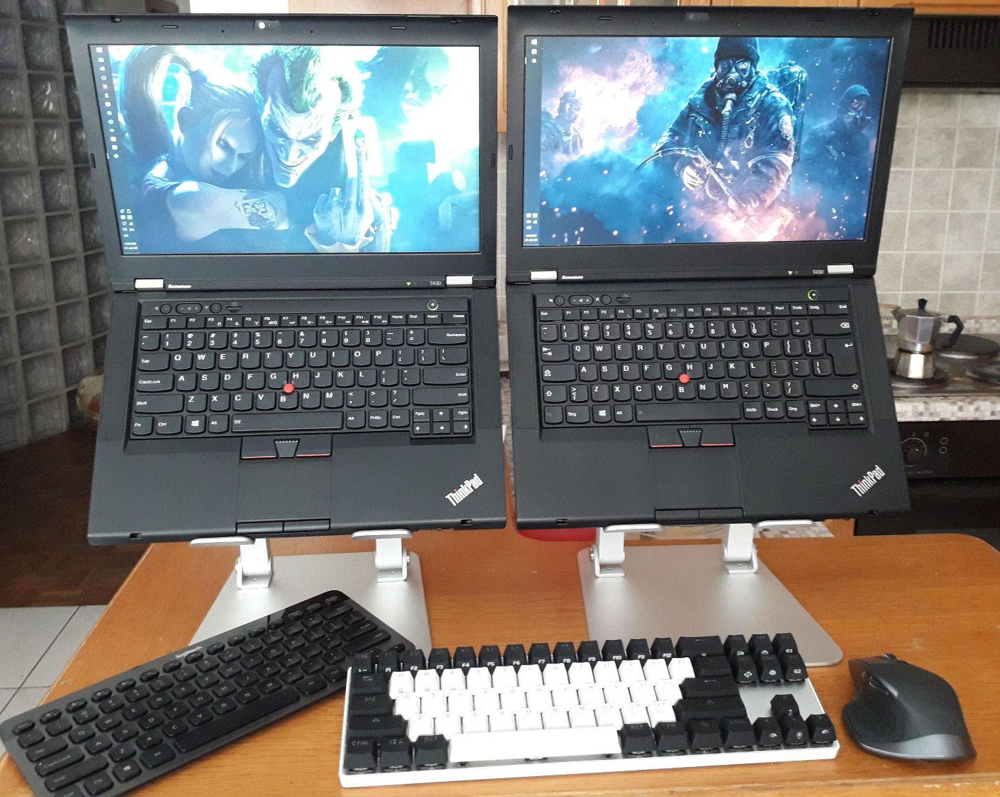
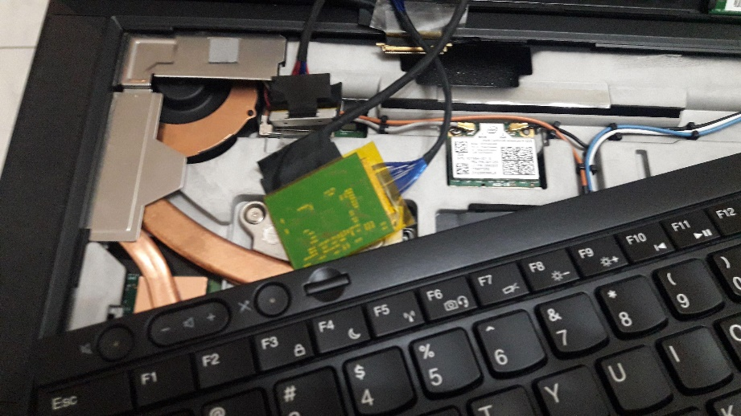
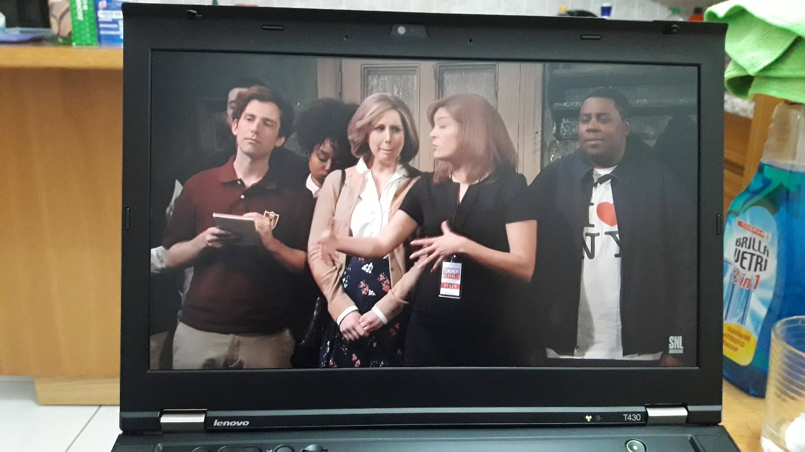

# T430 Modding Guide

<body>

</body>

by Heider Jeffer \| Free University of Bozen-Bolzano – Faculty of
Computer Science \| Italy

I've been receiving requests to create a modification guide for the T430 for over a year now, making this guide long overdue. During my master's studies in computer science and Ph.D. applications, I've modified and customized about a dozen T430 ThinkPads. I use them extensively for software development (e.g., Android Studio, Java, Robotic Webots), content creation (e.g., video editing, DaVinci Resolve, OBS, GIMP), and my current mobile powerhouse is my fully customized T430.

I've opened up, disassembled, and reassembled the T430 more times than I can count. Now, I'm excited to present the definitive T430 modding guide.

# Why T430?

I love the T430. I've discovered the joys of modding, flashing, and overclocking it, making it hands down the best laptop for me. The T530/W530, though slightly larger, offers similar modding potential with better thermal overhead for tasks like XM and supports a slightly better GPU.

Almost all the mods in this guide can also be applied to the T530/W530. If you're interested in modding those models, feel free to follow along.

# CPU

The T430 support the following Quad Core CPU

**i7–3632QM** 

The (35W/4C/8T/2.2GHz/3.2GHz) is the second of two quad-core chips at 35 watts. Despite its lower base speed, this chip significantly outperforms the i7-3540M in most use cases. If you don't plan to overclock and prefer to stick with a 35W CPU, this is an excellent choice. Keep in mind that even with the same TDP, the additional cores will generate more heat and reach the 35W limit more frequently. However, power usage will still average 35W over extended periods of heavy use.

Overclockable: No.

# T430 Motherboard

# Heatsink / Fan

Upgrading the CPU to a quad core (**i7–3632QM** ), replacing your
heatsink with the following:

**04W3269 / 0B41088 / 04W3270 ** are the dedicated GPU assemblies that include an extra copper pipe for better heat absorption from the GPU. Even if you don't have a dedicated GPU, you should consider getting one of these assemblies if you plan to use CPUs above 35W. This swap can significantly improve heat dissipation.

# Display

Upgrade the Screen to 1920\*1080 14.0'' by Heider Jeffer:

- AU Optronics B140HAN01.3 Display model MATTE IPS

- LCD controller board kit LVDS cable 1920X1080 IPS 1080P FHD Screen
  monitor full hd for thinkpad T430 lenovo T420

  
  
  

## Output Results 1920 x 1080 

# Keyboard Swap

## Backlit Keyboard

# 170W Adapter

# SATA Bay

# Touchpad “Replacement”

# Slice Battery

One of the less known things about the xx10 through xx30 lines of
ThinkPads is that they shipped with the precursor to the “power bridge”
battery technology, in the form of [<u>slice
batteries</u>](https://www.amazon.com/gp/product/B01EHMXCL0/ref=as_li_tl?ie=UTF8&tag=n4ru08-20&camp=1789&creative=9325&linkCode=as2&creativeASIN=B01EHMXCL0&linkId=a22cc4b646e241776ad8f630d3e9f2a3).
These slice batteries attach to the bottom of your ThinkPad and add a
whopping 94Wh with a standard 9-cell so you can use T430 with a whopping
188Wh of battery capacity, the highest of any ThinkPad in existence.

# RAM up to 16GB 

The T430 has two RAM slots, which support up to [<u>16GB of 2133MHz
DDR3L
RAM</u>](https://www.amazon.com/gp/product/B00NTQ0GOM/ref=as_li_tl?ie=UTF8&tag=n4ru08-20&camp=1789&creative=9325&linkCode=as2&creativeASIN=B00NTQ0GOM&linkId=70244be6e7d8d5ea26458da4fb595c87).

# T430 Accessories

1.  1 TB Nvme Samsung 970 EVO Plus (USB C to USB 3.1 Gen2 ).

2.  Mini Displayport 4-in-1 Adapter (Thunderbolt Compatible), HDMI / DVI
    / VGA with cable and audio port for Apple MacBook Pro.

3.  Aceele USB HUB 11-in-1 Type C Hub with 4k HDMI and 1080P VGA, 4 USB
    Ports, RJ45 Gigabit Ethernet, Mic, USB C PD, SD and TF Card Readers
    for MacBook PRO Surface Samsung Huawei P20 Logitech Webcam.

4.  CSL - HDMI to DVI adapter - DVI-D 24 and 1 Male connector on HDMI
    socket - Full HD - 1080p - PS3 video.

# 

