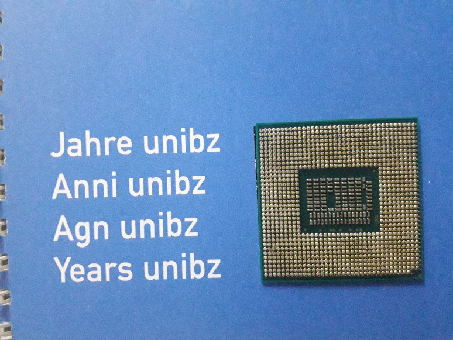
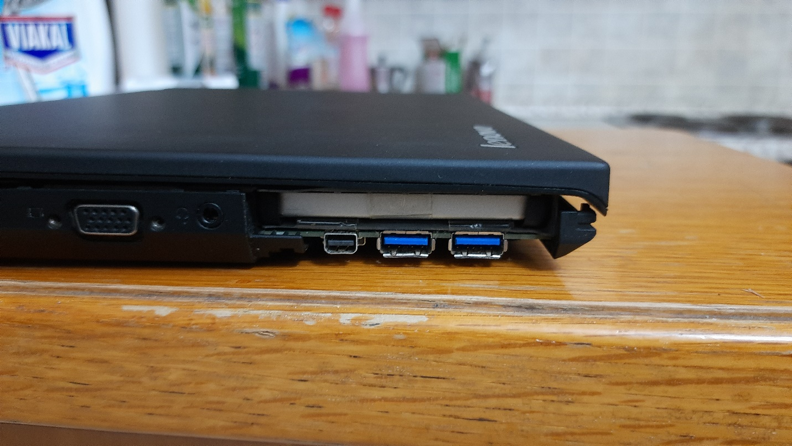
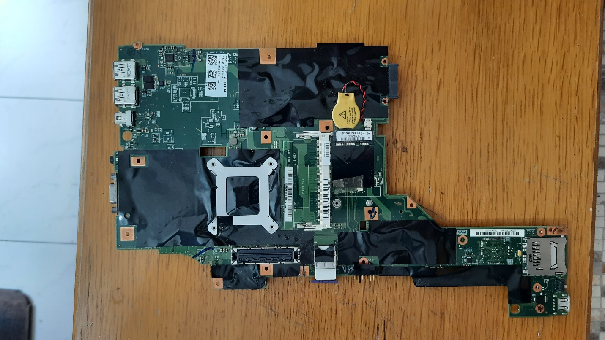
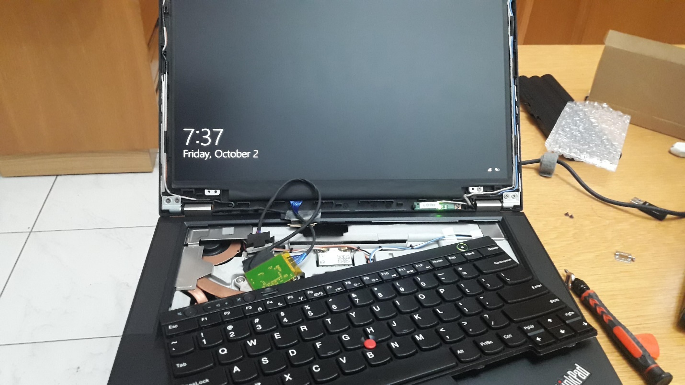

# T430 Modding Guide

by Heider Jeffer

I've been getting requests to create a modification guide for the T430
for over a year now, so this guide is long overdue. I've modded and
created probably about a dozen T430 ThinkPads in the last years at my
master studies in computer science and my mobile powerhouse is currently
my fully decked out and customized T430.

{width="6.5in" height="3.65625in"}

I've opened up, disassembled, and reassembled the T430 so many times it
makes my head spin thinking about it. So here we go, the definitive T430
modding guide.

# Why T430?

{width="6.5in" height="5.1875in"}

I love the machine. I've discovered the joys of modding, flashing, and
overclocking the T430 and it has become hands down the best laptop on
the planet for me (alongside the T530/W530 which is slightly bigger but
can be modded just as much and has better thermal overhead for things
like the XM, and supports a slightly better GPU).

{width="6.5in"
height="3.660416666666667in"}

Nearly all mods here can also be applied to the T530/W530, so if you're
interested in modding those machines feel free to follow this guide.

# CPU

{width="3.50879593175853in"
height="2.6315977690288714in"}
{width="2.798921697287839in"
height="2.6909722222222223in"}

The T430 support the following Quad Core CPU

[**i7--3632QM** (35W/4C/8T/2.2GH/3.2GHt) is the second of two quad core
chips at 35 watts.]{.mark} [Despite the significant decrease in base
speed, this chip vastly outperforms the i7--3540M in most use cases. If
you don't plan to overclock and want to stick with a 35W CPU, this will
serve you well. Note that despite the same TDP, you will get more heat
and hit the 35W spec more often simply due to having the extra cores to
power, but the power usage will still generally average 35W over time
with heavy use.]{.mark}\
**Overclockable: **No.

# Heatsink / Fan

{width="4.89132217847769in"
height="4.527777777777778in"}

Upgrading the CPU to a quad core ([**i7--3632QM** ]{.mark}), replacing
your heatsink with the following:

[**04W3269 / 0B41088 / 04W3270 **are the dedicated GPU assemblies that
contain the extra copper pipe for absorbing additional heat from the
dedicated GPU. Regardless of whether or not you actually have a dGPU,
you want one of these if you plan to go above 35W CPUs, or even then you
may want to consider this swap for the additional heat
dissipation.]{.mark}

# Display

**[Upgrade the Screen to 1920\*1080 14.0\'\' by Heider Jeffer.]{.mark}
Require:\
**

[AU Optronics B140HAN01.3 Display model MATTE IPS]{.mark}

[\
\
]{.mark}{width="3.1319444444444446in"
height="3.037584208223972in"}[\
\
]{.mark}

[LCD controller board kit LVDS cable 1920X1080 IPS 1080P FHD Screen
monitor full hd for thinkpad T430 lenovo T420\
\
]{.mark}{width="1.3398436132983378in"
height="2.3819444444444446in"}{width="4.147762467191601in"
height="2.3331167979002623in"}

## Results 1920 x 1080 

{width="6.5in" height="3.65625in"}

~~\
~~{width="6.5in" height="3.65625in"}

# Keyboard Swap

## Backlit Keyboard

{width="6.5in" height="3.65625in"}

{width="6.5in" height="3.65625in"}

{width="6.5in" height="3.65625in"}

# 170W Adapter

{width="6.5in" height="3.65625in"}

# SATA Bay

{width="4.361111111111111in"
height="4.197569991251093in"}

# Touchpad "Replacement"

{width="3.297029746281715in"
height="3.297029746281715in"}

# Slice Battery

{width="6.5in" height="3.65625in"}

{width="5.277227690288714in"
height="2.9684405074365703in"}{width="2.283416447944007in"
height="4.059406167979002in"}

One of the less known things about the xx10 through xx30 lines of
ThinkPads is that they shipped with the precursor to the "power bridge"
battery technology, in the form of [[slice
batteries]{.underline}](https://www.amazon.com/gp/product/B01EHMXCL0/ref=as_li_tl?ie=UTF8&tag=n4ru08-20&camp=1789&creative=9325&linkCode=as2&creativeASIN=B01EHMXCL0&linkId=a22cc4b646e241776ad8f630d3e9f2a3).
These slice batteries attach to the bottom of your ThinkPad and add a
whopping 94Wh with a standard 9-cell so you can use T430 with a whopping
188Wh of battery capacity, the highest of any ThinkPad in existence.

# RAM, Battery, Storage

{width="6.061695100612424in"
height="3.138888888888889in"}

The T430 has two RAM slots, which support up to [[16GB of 2133MHz DDR3L
RAM]{.underline}](https://www.amazon.com/gp/product/B00NTQ0GOM/ref=as_li_tl?ie=UTF8&tag=n4ru08-20&camp=1789&creative=9325&linkCode=as2&creativeASIN=B00NTQ0GOM&linkId=70244be6e7d8d5ea26458da4fb595c87).

# T430 Accessories

{width="6.115441819772529in"
height="3.8541666666666665in"}

1.  1 TB Nvme Samsung 970 EVO Plus (USB C to USB 3.1 Gen2 ).

2.  Mini Displayport 4-in-1 Adapter (Thunderbolt Compatible), HDMI / DVI
    / VGA with cable and audio port for Apple MacBook Pro.

3.  Aceele USB HUB 11-in-1 Type C Hub with 4k HDMI and 1080P VGA, 4 USB
    Ports, RJ45 Gigabit Ethernet, Mic, USB C PD, SD and TF Card Readers
    for MacBook PRO Surface Samsung Huawei P20 Logitech Webcam.

4.  CSL - HDMI to DVI adapter - DVI-D 24 and 1 Male connector on HDMI
    socket - Full HD - 1080p - PS3 video.
